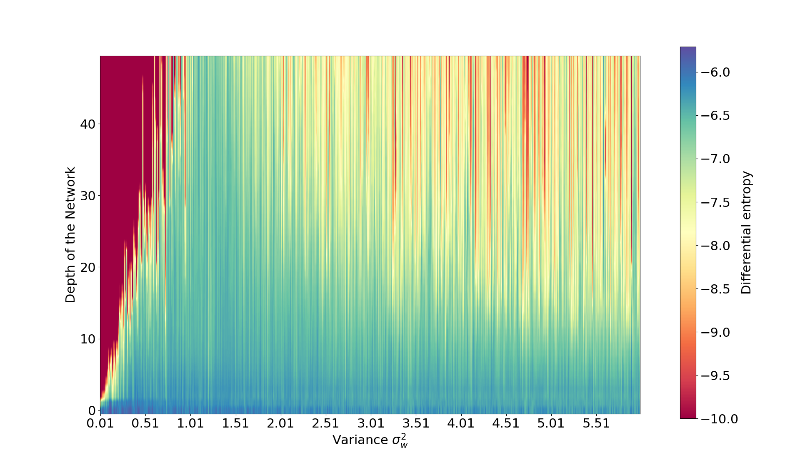
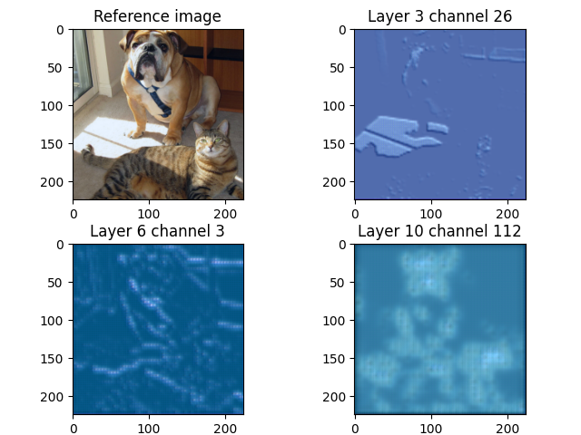
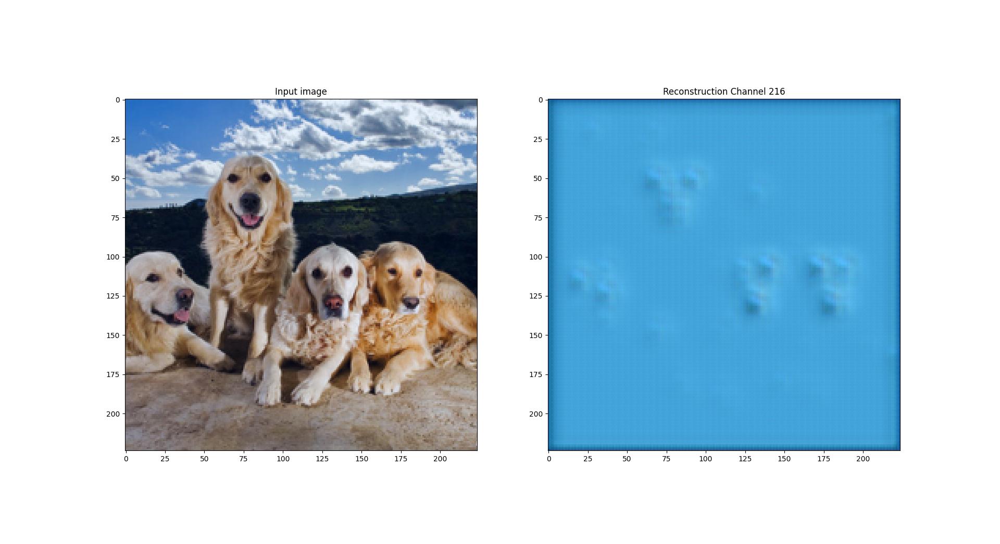
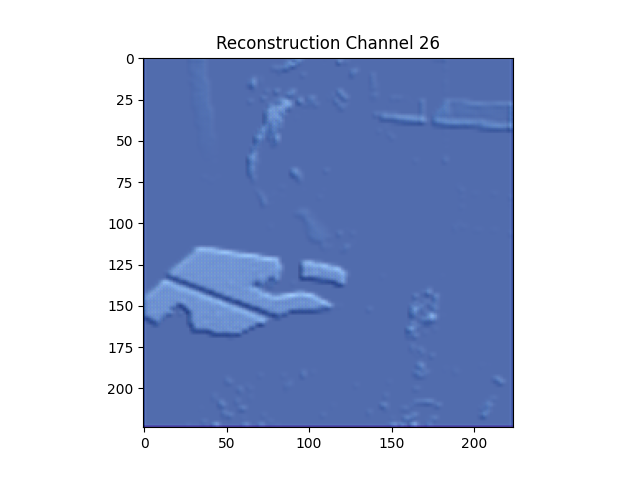
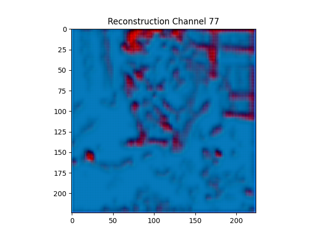
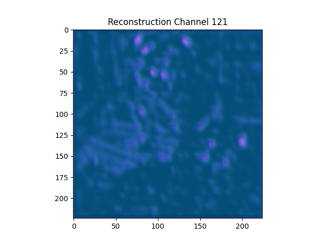

# Infoflow-paper

Official repository to [arXiv:2406.12916](https://arxiv.org/abs/2406.12916).

### Please check the paper for more details and a better description

Abstract:
An important challenge in machine learning is to predict the initial conditions under which a given neural network will
be trainable. We present a method for predicting the trainable regime in parameter space for deep feedforward neural
networks, based on reconstructing the input from subsequent activation layers via a cascade of single-layer auxiliary
networks. For both MNIST and CIFAR10, we show that a single epoch of training of the shallow cascade networks is
sufficient to predict the trainability of the deep feedforward network, thereby providing a significant reduction in
overall training time. We achieve this by computing the relative entropy between reconstructed images and the original
inputs and show that this probe of information loss is sensitive to the phase behavior of the network. Our results
provide a concrete link between the flow of information and the trainability of deep neural networks, further
elucidating the role of criticality in these systems.

## General concept

The idea of this repository and the article is to measure the entropy in deep neural networks to predict trainability
before training. This is done by using a set of reconstruction networks we call cascade. These cascades not only allow
for quantifying the information in the hidden layers of neural networks (and subsequently identify regions of best
training) but also allow for a first step in interpreting and understanding the decision-making process. The whole
procedure of how the reconstructions work is illustrated in the following figure.

## Measuring the entropy

### MLP

As shown in [Schoenholz](https://arxiv.org/abs/1611.01232) neural networks experience a phase transition in the variance
of weights during initialization. Thereby, training is optimal close to the phase transition (critical regime). Using
the differential or relative entropy, these regimes can be identified before training.

This can be seen in the following measurement of differential entropy for an untrained deep neural network on the MNIST
data. The different colors encode the differential entropy. At a variance of around 1.7, a blue cone can be seen. At
these variances, the neural network can propagate the information into deeper layers (bigger differential entropy)
allowing for better trainability. In the ordered regime (left side, red) the information is lost fast indicating a
not-trainable regime. In the chaotic phase (right side, green/yellow-ish) some information is still propagated into
deeper layers of the neural network. Therefore, the networks are more trainable but less good as in the critical phase.
This matches with the results in [Schoenholz](https://arxiv.org/abs/1611.01232), where the trainability is determined
experimentally by training the networks.

### CNN

Experimental results in [Xiao](https://arxiv.org/pdf/1806.05393) fig. 2. Entropy prediction:

### ResNet

Please note that the ResNet in this experiment is constructed in analogy to [He](https://arxiv.org/abs/1512.03385)
and thus differs from [Yang](https://arxiv.org/pdf/1712.08969).

Please note that the depth of the y-axis describes the number of ResNet blocks (i.e. skip connections).
Each forward pass (ignoring the skip connection) consists of 2 conv layers. Therefore, the networks in the plot
consist of 100 conv layers.

## Interpreting the network's decisions

### MNIST toy-example

Applying the cascades, we can observe the change in features the network performs over its depth. An example is given in
the following image.

In the first line, the reconstructions of an input 5 are shown for the 1st to L-th (L = 9) layer. As can be seen, the
network seems to sharpen some features, in particular, the upper left edge of the 5, connecting its main body and
horizontal bar. This is rather interesting as for the next input
(also with label 5) this is the exact feature that is not present and the network connects both with a smooth line. This
might cause the network to wrongly predict the result as a 6 rather than a 5.

At last, by applying the method on artificial activation vectors, we can construct an input the network would consider
optimal for this class. This is shown in the lowest part of the image, where different numbers are created through the
reconstruction.

### Vgg16 example

We analyse the Vgg16 network using the reconstructions. Vgg16 is the winner of the ImageNet challenge
2014 [Simonyan](https://arxiv.org/abs/1409.1556). The ImageNet dataset is a dataset of 1000 different
classes [Deng](https://ieeexplore.ieee.org/document/5206848). We use a trained version of Vgg16 available
at [pytorch](https://pytorch.org/vision/main/models/generated/torchvision.models.vgg16.html).
As an example, and for comparability, we use following image taken from [Selvaraju](https://arxiv.org/abs/1610.02391).
](images/reference.png)
The reconstruction networks are trained on the ImageNet dataset (random subsample with 30000 entries).

The first image shows some selected channel reconstructions in different layers of Vgg16:

A reconstruction of all channels after the last Maxpooling layer (conv part of network). 
The reconstruction is more blurred as the pooling naturally throws information away.

Some channels, especially at deeper layers, seem to store more complex features. Channel 216 in layer 10 seems to store
faces. This can already be seen in the reconstruction for that channel for the input above (channel in section Layer 10 
bellow). However, it becomes more evident, when considering further input images e.g.

Finally, some more nice plots of different channels and reconstructions. 
The naming convention is `<layer>_<channel>.png`.

#### Layer 3

#### Layer 6

#### Layer 10

